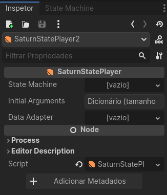

<p align="center">
  
</p>

# Saturn

A Godot Plugin to manage simple cascade state machine

> Works only on Godot 4.x versions

<br>

## Table of Contents

- [🪐 What is Saturn?](#what-is-saturn)
- [🔧 Installation](#installation)
- [📝 Getting Started](#getting-started)
- [🤔 FAQ](#faq)

<br>
<a id="what-is-saturn"></a>

## 🪐 What is Saturn?

Saturn is a versatile addon crafted for the Godot game engine, designed to streamline and simplify the management of states within your game projects. At its core, Saturn serves as a robust state management tool, offering developers a straightforward solution for organizing and transitioning between different states within their games.

### Simple Cascade State Machine


Define your state machine, and Saturn will efficiently determine and return the initial reachable state, simplifying your state management process.

<br>
<a id="installation"></a>

## 🔧 Installation

- You can search "Saturn" on Godot Assets Library
- You can download this repo, copy and paste the `addons/saturn` into your project's folder

<br>
<a id="getting-started"></a>

## 📝 Getting Started

### Creating a Saturn State Machine

To start just create a `SaturnStatePlayer`



Then you will create a state machine of the type `SaturnStateGroup`, after this you can use the `State Machine` tab


You can use the add button to add new states on the state machine.

<br>

### State Types

#### Group State


It's merely a collection of states without any distinctive characteristics or behavior.

#### Condition State


With this state, you have the ability to specify an argument name, an operator, and a value. When this condition holds true, the enclosed states will be invoked.

#### Cooldown State


You can set a cooldown period, causing the state machine to wait for a specified duration before re-entering the states within. Typically, this state will be nested within a conditional state.

#### Value State


The value state determines the state machine's status upon reaching it.

#### Value Lock State


Using this state, you can temporarily lock to a state for a specified duration.

Also you can lock a state by code, using:

```godot
saturn_state_player.lock_state(state, time)
```

### Arguments

You can use the arguments to check conditions, using:

```godot
saturn_state_player.set_argument("argument_name", value)
```

<br>

### How to get the state

You can get the state using:

```godot
saturn_state_player.get_state
```

#### Adapting state results

By default all states will be int, but you can use a data adapter to change the state to an enum.

for example:

```godot
class_name TestDataAdapter extends SaturnDataAdapter

enum State{
	IDLE,
	JUMPING,
	CROUCHING
}

func from_data(state: Variant) -> int:
	return state

func to_data(state: int) -> State:
	return State.get(State.keys()[state])

func get_data_list() -> Array:
	return State.keys()
```

after create the script you just use in the `SaturnStatePlayer`


then all states will be translated using the data adapter


<br>
<a id="faq"></a>

## 🤔 FAQ

- **I Found a BUG!** _[Click here](https://github.com/GumpDev/saturn/issues) and open an issue_
- **Can I help with the project?** _Sure! just send your PR :D_
- **Can I contact you?** _Yep, send email to contact@gump.dev_
